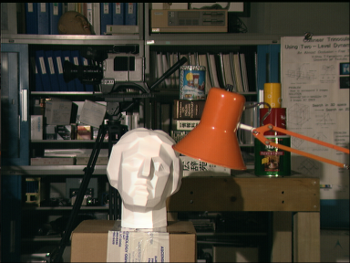
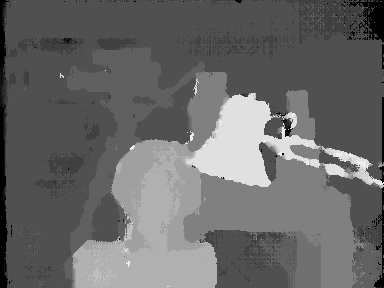
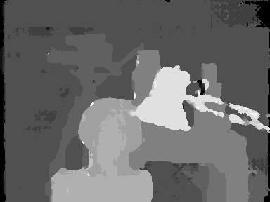

# Stereo Matching using Semi-Global Matching

> **Repository Moved**  
> This repository has been moved to a new location and is no longer maintained here.  
> Please visit the new repository: https://github.com/aposb/stereo-matching-algorithms  
> This repository is archived and kept for reference only.

Stereo Matching using Semi-Global Matching implemented in MATLAB and Python.

## Features

### Stereo matching algorithms

- **Semi-Global Matching (SGM)**
- **Semi-Global Block Matching (SGBM)**

The algorithms are implemented in both MATLAB and Python.

All algorithms are optimized for performance using matrix operations and other techniques.

## Installation

Download the project as ZIP file, unzip it, and run the scripts.

### Python Requirements

- NumPy
- Matplotlib
- OpenCV (`opencv-python`)

## Usage

The project contains MATLAB and Python scripts, each implementing a stereo matching algorithm. The files `left.png` and `right.png` contain the stereo image pair used as input.
To use a different stereo pair, replace these two images with your own. In this case, you must also adjust the **disparity levels** parameter in the script you are running.
You may optionally modify other parameters as needed. If the input images contain little or no noise, it is recommended not to use the Gaussian filter.

The results between MATLAB and Python implementation are similar.

## Results

Below are the disparity maps produced from the **Tsukuba stereo pair**.

 

### Semi-Global Matching

### Semi-Global Block Matching

## Related Repositories

- [Stereo Matching Algorithms in MATLAB](https://github.com/bollasap/stereo-matching-algorithms-matlab)
- [Stereo Matching Algorithms in Python](https://github.com/bollasap/stereo-matching-algorithms-python)

## License

This project is licensed under the MIT License. See the [LICENSE](LICENSE) file for details.
